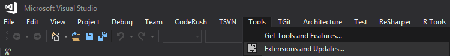

#


[Unchase Dynamics365 Connected Service](https://marketplace.visualstudio.com/items?itemName=Unchase.unchaseDynamics365ConnectedService) is a Visual Studio 2017/2019 extension to generate early-bound .NET Framework (or C++) classes that represent the entity data model used by Dynamics 365 for Customer Engagement.

> The project is developed and maintained by [Nikolay Chebotov (**Unchase**)](https://github.com/unchase).

## Table of content

* [Getting Started](#Start)
* [Generate entity classes](#Entity)
* [Generate an OrganizationServiceContext class](#OrganizationServiceContext)
* [Use generated classes](#Use)
* [Run the Connected Service](#Run)
* [Create Extensions for the Connected Service](#Extensions)

## <a name="Start"></a> Getting Started

Install from `Tools -> Extensions and Updates` menu inside [Visual Studio](https://visualstudio.microsoft.com/vs/) 2017 (for [VisualStudio](https://visualstudio.microsoft.com/vs/) 2019: `Extensions -> Manage Extensions`) or [download](https://marketplace.visualstudio.com/items?itemName=unchase.unchaseDynamics365ConnectedService)  as `VSIX` package from [Visual Studio Marketplace](https://marketplace.visualstudio.com/items?itemName=Unchase.unchaseDynamics365connectedservice):



*“Extensions and Updates…” menu item in Visual Studio Community 2017 v15.9.12*


*“Manage Extensions” menu item in Visual Studio Community 2019 v16.1.3*

*//ToDo: add image with downloading and adding the Connected Service to Visual Studio*

## <a name="Entity"></a> Generate entity classes
The [Connected Service](https://marketplace.visualstudio.com/items?itemName=Unchase.unchaseDynamics365ConnectedService) creates a `Microsoft Visual C#` or `Visual Basic .NET` (or `C++`) output file that contains strongly-typed classes for entities in your organization. 
This includes custom entities and attributes. This output file contains one class for each entity, providing early binding and *IntelliSense* support in Visual Studio to aid you as you write code. 

The generated classes are partial classes that can be extended with custom business logic in separate files. 
You can also create extensions and use it in this tool. 
For more information, see [Create Extensions for the Connected Service](#Extensions).

## <a name="OrganizationServiceContext"></a> Generate an OrganizationServiceContext class
The [Connected Service](https://marketplace.visualstudio.com/items?itemName=Unchase.unchaseDynamics365ConnectedService) can also be used to generate a class derived from the [OrganizationServiceContext](https://docs.microsoft.com/en-us/dotnet/api/microsoft.xrm.sdk.client.organizationservicecontext?view=dynamics-general-ce-9) class that acts as an entity container in the entity data model. 
This service context provides the facilities for tracking changes and managing identities, concurrency, and relationships. 

This class also exposes a [SaveChanges()](https://docs.microsoft.com/en-us/dotnet/api/microsoft.xrm.sdk.client.organizationservicecontext.savechanges?view=dynamics-general-ce-9#Microsoft_Xrm_Sdk_Client_OrganizationServiceContext_SaveChanges) method that writes inserts, updates, and deletes records in `Common Data Service`. 

For more information, see Use [OrganizationServiceContext](https://docs.microsoft.com/en-US/powerapps/developer/common-data-service/org-service/organizationservicecontext).

*//ToDo: add image with option*

## <a name="Use"></a> Use generated classes
The classes created by the [Connected Service](https://marketplace.visualstudio.com/items?itemName=Unchase.unchaseDynamics365ConnectedService) are designed to be built into a class library that can be referenced by projects that use **Common Data Service**. 
After you have generated the class file using the *Connected Service*, you should add the file to your Visual Studio project.
You must also add references to several assemblies that the generated classes are dependent upon.

The following lists assemblies that must be referenced in your project when you use the generated code file.

* `Microsoft.Crm.Sdk.Proxy.dll`
* `Microsoft.Xrm.Sdk.dll`

These assemblies are part of the [Microsoft.CrmSdk.CoreAssemblies](https://www.nuget.org/packages/Microsoft.CrmSdk.CoreAssemblies/) NuGet package. Use this Nuget packages to add these assemblies to your Visual Studio project.

*//ToDo: add gif?*

## <a name="Run"></a> Run the Connected Service

The [Connected Service](https://marketplace.visualstudio.com/items?itemName=Unchase.unchaseDynamics365ConnectedService) takes several parameters that determine the contents of the file that is created:

*//ToDo: add image (with options desription)*

## <a name="Extensions"></a> Create Extensions for the Connected Service

1. Create a **.NET Framework 4.7.2 library** project

2. Add **[Unchase.Dynamics365.Customization](https://www.nuget.org/packages/Unchase.Dynamics365.Customization/)** NuGet package to your project

3. Add a custom *public class* that implements one of interfaces from NuGet package: 

* **`ICustomizeCodeDomService`** - called after the CodeDOM generation has been completed, assuming the default instance of `ICodeGenerationService`. It is useful for generating additional classes, such as the constants in picklists

* **`ICodeWriterFilterService`** - called during the process of CodeDOM generation, assuming the default instance of `ICodeGenerationService`, to determine whether a specific object or property should be generated

* **`ICodeWriterMessageFilterService`** - called during the process of CodeDOM generation, assuming the default instance of `ICodeGenerationService`, to determine whether a specific message should be generated. This should not be used for requests/responses as these are already generated in *Microsoft.Crm.Sdk.Proxy.dll* and *Microsoft.Xrm.Sdk.dll*

* **`IMetadataProviderService`** - called to retrieve the metadata from the server. This may be called multiple times during the generation process, so the data should be cached

* **`IMetaDataProviderQueryService`**

* **`ICodeGenerationService`** - core implementation of the CodeDOM generation. If this is changed, the other extensions may not behave in the manner described

* **`INamingService`** - called during the CodeDOM generation to determine the name for objects, assuming the default implementation

4. The following sample code demonstrates how to write an extension:

```csarp
using System;
using System.Threading.Tasks;
using Microsoft.Xrm.Sdk.Metadata;
using Unchase.Dynamics365.Customization;

namespace TestDynamics
{
    /// <summary>
    /// Sample extension for the "Unchase Dynamics365 Connected Service" that generates early-bound
    /// classes for custom entities.
    /// </summary>
    public sealed class BasicFilteringService : ICodeWriterFilterService
    {
        public BasicFilteringService(ICodeWriterFilterService defaultService)
        {
            this.DefaultService = defaultService;
        }

        private ICodeWriterFilterService DefaultService { get; set; }

        public async Task<bool> GenerateAttributeAsync(AttributeMetadata attributeMetadata, IServiceProvider services)
        {
            return await this.DefaultService.GenerateAttributeAsync(attributeMetadata, services);
        }

        public async Task<bool> GenerateEntityAsync(EntityMetadata entityMetadata, IServiceProvider services)
        {
            if (!entityMetadata.IsCustomEntity.GetValueOrDefault()) { return false; }
            return await this.DefaultService.GenerateEntityAsync(entityMetadata, services);
        }

        public async Task<bool> GenerateOptionAsync(OptionMetadata optionMetadata, IServiceProvider services)
        {
            return await this.DefaultService.GenerateOptionAsync(optionMetadata, services);
        }

        public async Task<bool> GenerateOptionSetAsync(OptionSetMetadataBase optionSetMetadata, IServiceProvider services)
        {
            return await this.DefaultService.GenerateOptionSetAsync(optionSetMetadata, services);
        }

        public async Task<bool> GenerateRelationshipAsync(RelationshipMetadataBase relationshipMetadata, EntityMetadata otherEntityMetadata, IServiceProvider services)
        {
            return await this.DefaultService.GenerateRelationshipAsync(relationshipMetadata, otherEntityMetadata, services);
        }

        public async Task<bool> GenerateServiceContextAsync(IServiceProvider services)
        {
            return await this.DefaultService.GenerateServiceContextAsync(services);
        }
    }
}
```

## HowTos

- [ ] Add HowTos in a future
- [ ] ... [request for HowTo you need](https://github.com/unchase/Unchase.Dynamics365.Connectedservice/issues/new?title=DOC)

### Installation completes but I can't see the Service in the list of connected services (Visual Studio 2019)

- Relevant [bug report](https://developercommunity.visualstudio.com/content/problem/468751/vs2019-preview-cannot-install-connected-service-ex.html). `Connected Services` restored in the v16.1.3 update to [Visual Studio](https://visualstudio.microsoft.com/vs/) 2019.

## Roadmap

See the [changelog](CHANGELOG.md) for the further development plans and version history.

## Thank me!

If you like what I am doing and you would like to thank me, please consider:

[](https://www.buymeacoffee.com/nikolaychebotov)

Thank you for your support!

----------

Copyright &copy; 2019 [Nikolay Chebotov (**Unchase**)](https://github.com/unchase) - Provided under the [Apache License 2.0](LICENSE.md).

